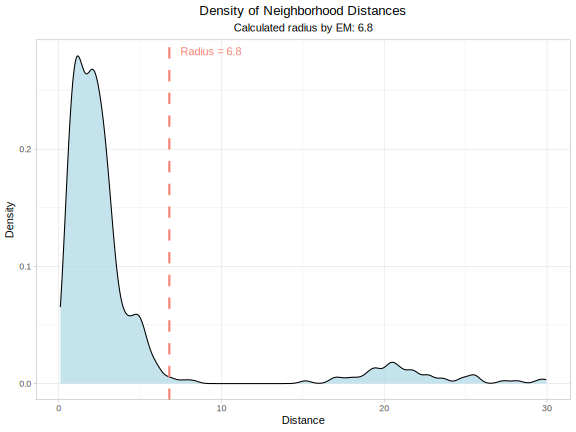
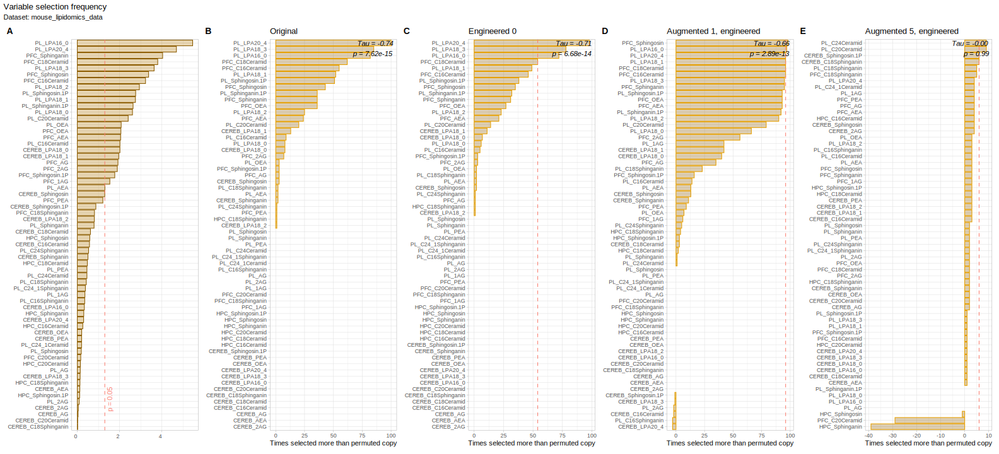

# Error-controlled generative AI with feature importance analysis  
## Mitigating error propagation in generative AI via dimensionality modulation as a method for safe biomedical dataset augmentation

This repository implements a pipeline with built-in error control mechanisms for self-organising neural network generative AI (genESOM), leveraging dimensionality change detection to preserve dataset validity during augmentation.

## Overview

This framework enables biomedical data augmentation with automatic error control. Using Emergent Self-Organising Maps (ESOM), the pipeline separates data structure learning from data generation, exploiting dimensionality changes to detect and prevent error inflation in synthetic data.

A key innovation is injecting a 'diagnostic' signal that provides a data-driven stopping point for augmentation, thus safeguarding the validity of AI-augmented datasets and mitigating error inflation—a common challenge in generative AI approaches.

The repository includes relevant R and Python code.

## Core concept

Unlike typical generative models, genESOM separates learning of data structure from the data generation process, enabling:

1. Generation of data with altered dimensionality relative to the training set  
2. Implementation of stopping criteria for augmentation based on feature importance stability  

## Key components

### Data structure learning
- **ESOM U-matrix training** to capture data topology  
- **Density radius calculation** to guide synthetic data generation  

**Figure:** Selection of hypersphere radius for density estimation based on the probability density distribution of distances between data points. Created using R (v4.3.3 for Linux) and the ggplot2 library.

### Synthetic data generation
- **Density-based augmentation** with configurable generation rates  
- **Diagnostic signal injection** for error inflation detection  
- **Stopping criteria** based on monitoring feature importance stability  

### Feature importance analysis
- **Cross-variant comparison** of feature importance across:  
  - Original data  
  - Engineered data with permuted features  
  - Synthetic augmented data at multiple generation rates  
- **Detection of error inflation** via shifts in feature importance  

## Experiments and datasets

### Artificial datasets  
Generated using [generate_artifical_datasets.R](https://github.com/JornLotsch/genESOMerrorSignal/blob/main/generate_artifical_datasets.R), including:

- **Ascending significance dataset:** Systematic class differences to test error inflation control.  
- **No-effect dataset:** Classes without statistical differences to test false positive robustness.

### Biomedical datasets  
Evaluated via dedicated analysis scripts:

- **Mouse lipidomics dataset** (code: `mouse_lipidomics_analysis.R`)  
  In-house preclinical lipidomics data from mice with immune modulation.  

  

  **Figure:** Supervised learning for lipid mediators predicting group assignment (no EAE, EAE, or EAE + fingolimod). Panels A–E show variable selection via a random forest–based Boruta approach using out-of-bag permutation importance (1,000 permutations) and Z-statistics for significance:  
  - Panel A: Confirmed significant variables as horizontal bars indicating selection frequency over 1,000 Boruta runs.  
  - Panel B: Variable significance comparing original variables and their permuted ("engineered") versions; red dashed line marks the 95th percentile threshold from bootstrapped differences.  
  - Panel C: Analysis with one engineered synthetic case per original case added.  
  - Panel D: Analysis with five engineered synthetic cases per original point added.

- **Heart failure clinical records dataset** (code: `heart_failure_analysis.R`)  
  Public clinical data from UCI ML Repository.

- **Indian liver patient dataset** (code: `indian_liver_patient_analysis.R`)  
  Demographic and biochemical patient data from UCI ML Repository.

- **Pain thresholds sex dataset** (code: `pain_thresholds_sex_analysis.R`)  
  Quantitative pain sensitivity data evaluating biological sex effects.

- **Gallstone clinical dataset** (code: `gallstone_data_analysis.R`)  
  Bioimpedance and clinical lab data predicting gallstone disease.

- **Golub cancer genomics dataset** (code: `golub_cancer_genomics_analysis.R`)  
  Leukemia gene expression data from Bioconductor’s golubEsets package.

## Dependencies

Required R packages:

- Umatrix, dbt.DataIO (for ESOM training)  
- Boruta, caret, reshape2 (for feature importance analysis)  
- ggplot2, cowplot (for visualization)  
- parallel, pbmcapply (for parallel processing)  

Optional:

- missForest, forecast, outliers (for data preprocessing, if used)

## Installation

Clone this repository and install the required R packages. Python code included has been tested on Python 3.11.7 for Linux.

## Feature importance pipeline parameters

- `output_dir`: Directory for saving results  
- `output_prefix`: Prefix for output files  
- `input_file`: Path to input CSV file  
- `class_name`: Target class column name  
- `generation_multipliers`: Vector of synthetic data generation multipliers  
- `base_generation_rate`: Base synthetic data generation rate  
- `nIter`: Boruta algorithm iteration count  
- `seed`: Random seed for reproducibility  
- `enable_plots`: Toggle to generate/display plots  
- `enable_file_output`: Toggle to save outputs to files  

## Outputs and interpretation

Pipeline outputs include:

1. Feature importance stability plots across generation multipliers  
2. Dimensionality shift indicators revealing synthetic data signal degradation  
3. Bar and radial plots depicting changes in feature selection frequency  
4. Comparative analyses of feature importance variants  
5. Statistical summaries of significant variables and their stability  

## Applications

This approach supports:

- Biomedical data augmentation with integrated quality control  
- Detection of error inflation onset in synthetic data generation  
- Data-driven stopping points for augmentation  
- Preservation of AI-augmented dataset validity  
- Comparative feature importance stability analysis  

## Project context and related publications

This repository is part of a broader research effort comprising three related studies:

1. The foundational genESOM self-organising neural network method:  
   Ultsch and Lötsch, 2024, *Brief Bioinformatics*, DOI: [10.1093/bib/bbae640](https://doi.org/10.1093/bib/bbae640). This paper introduces the core generative AI method for augmenting small biomedical datasets.

2. The current main study extending genESOM with error control mechanisms to mitigate error propagation during synthetic data generation:  
   Lötsch, J, Himmelspach A, Kringel D. (2025). Mitigating error propagation in generative AI via dimensionality modulation as a method for safe biomedical dataset augmentation. *iScience* [in revision].

3. A related preprint presenting applications of generative AI for knowledge extraction from preclinical studies with limited samples:  
   Lötsch, J., Mayer, B., de Bruin, N., Ultsch, A. (2025). Generative AI Enhances Knowledge Extraction from Preclinical Studies with Reduced Sample Size. SSRN Preprint [https://ssrn.com/abstract=5099319](https://ssrn.com/abstract=5099319) (work in progress, resubmission underway).

## License

This repository and its contents (scripts, figures, and supporting materials) are shared under the Creative Commons Attribution 4.0 International License (CC BY 4.0). You are free to use, share, and adapt the materials provided that appropriate credit is given to the original authors and this repository is cited in all derived works or publications.

## Citation

Lötsch, J, Himmelspach A, Kringel D. (2025). Mitigating error propagation in generative AI via dimensionality modulation as a method for safe biomedical dataset augmentation. *iScience* [in revision].

**Note:** This repository targets detection and control of error inflation signals during synthetic data generation. The underlying genESOM method was originally described in Ultsch and Lötsch, 2024, *Brief Bioinformatics*, DOI: [10.1093/bib/bbae640](https://doi.org/10.1093/bib/bbae640). This work extends it with error detection mechanisms for safe biomedical dataset augmentation.
